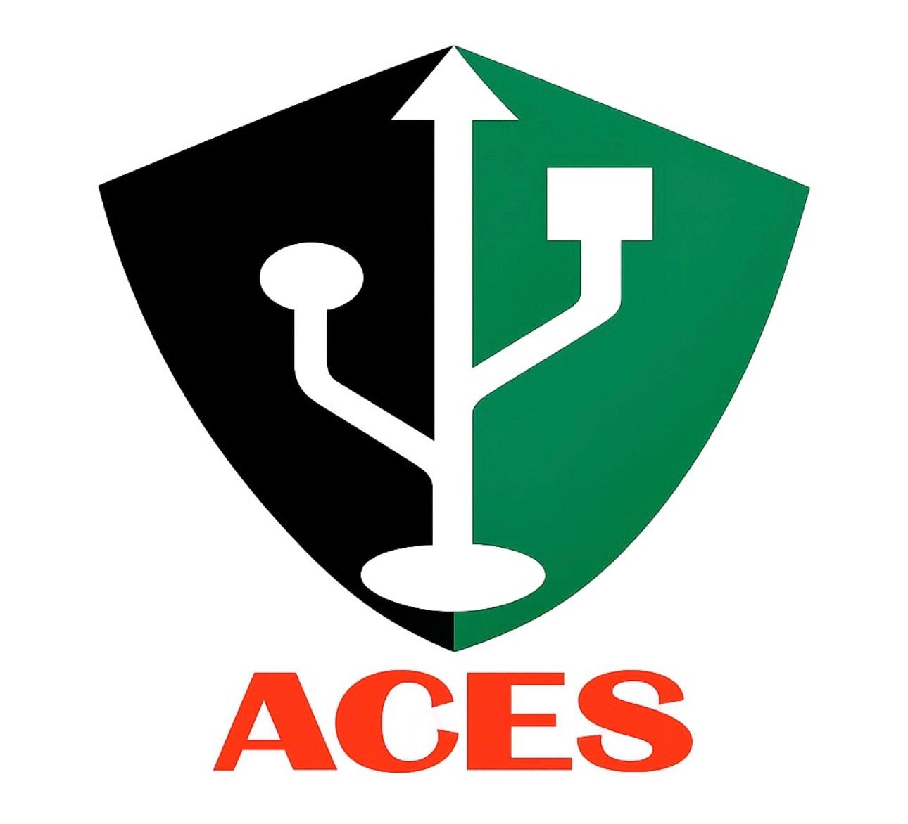

<div align="center">
  
  <h1>ACES Website</h1>
  <p><strong>The official website for the Association of Computer Engineering Students (ACES)</strong></p>
</div>

---

## 🚀 Overview

Welcome to the **ACES Website** repository! This application is built with modern web technologies to serve the ACES community, showcasing events, team members, the gallery, and more. 

This `README.md` is specifically designed for developers and future maintainers to understand the project structure, how to run it locally, and how to contribute effectively to keep the website thriving.

## 🛠 Tech Stack

Our website is powered by a robust and modern stack:
- **Framework:** [Next.js 15+](https://nextjs.org/) (App Router)
- **Language:** [TypeScript](https://www.typescriptlang.org/) for solid type safety
- **Styling:** [Tailwind CSS v4](https://tailwindcss.com/) for rapid UI development
- **Animations:** [Framer Motion](https://www.framer.com/motion/) for smooth user experiences
- **Icons:** [Lucide React](https://lucide.dev/) for clean, consistent iconography

## 📂 Project Structure

```text
aces-website/
├── public/              # Static assets (images, logos, etc.)
│   ├── aces.png         # Main ACES logo
│   └── aceslogo.png     # Alternative ACES logo
├── src/
│   ├── app/             # Next.js App Router (Pages & Layouts)
│   │   ├── about/       # Organization information
│   │   ├── contact/     # Contact page
│   │   ├── events/      # Upcoming and past events
│   │   ├── gallery/     # Photo gallery
│   │   ├── team/        # Team members page
│   │   └── globals.css  # Global Tailwind styles
│   └── components/      # Reusable React UI components
├── package.json         # Project dependencies and npm scripts
└── next.config.ts       # Next.js application configuration
```

## 💻 Getting Started

### Prerequisites

Ensure you have the following installed on your local machine:
- **Node.js** (v18.17.0 or higher recommended)
- **npm**, **yarn**, **pnpm**, or **bun**

### Local Installation

1. **Clone the repository:**
   ```bash
   git clone <repository-url>
   cd aces-website
   ```

2. **Install dependencies:**
   ```bash
   npm install
   # or
   yarn install
   # or
   pnpm install
   ```

3. **Run the development server:**
   ```bash
   npm run dev
   # or
   yarn dev
   # or
   pnpm dev
   ```

4. **View the website:** Open [http://localhost:3000](http://localhost:3000) with your browser to see the result. Pages auto-update as you edit the source files!

## 🛠 Maintenance Guide

As a future maintainer, here are some key areas you should be familiar with to easily manage changes:

### 1. Adding or Updating Pages
All pages are located under the `src/app/` directory. Next.js App Router uses file-based routing. To create a new page context, simply create a new folder inside `src/app/` (e.g., `src/app/new-page`) and add a `page.tsx` file inside it.

### 2. Modifying the UI & Components
If you need to change a shared piece of UI—such as navigation bars, footers, buttons, or section wrappers—look in the `src/components/` directory. Keep components modular and reusable!

### 3. Styling Upgrades
The project uses Tailwind CSS v4. Global styles and directives are defined in `src/app/globals.css`. Styling should primarily be handled through standard Tailwind utility classes directly in the `.tsx` components.

### 4. Updating Content (Team, Events, Gallery)
Content data like events, gallery images, or team members are typically rendered in their respective page components (e.g., `src/app/team/page.tsx`). If text or team members need to change, navigate to these specific files and update the static arrays or components. 

### 5. Managing Assets
All images meant to be public-facing, like the ACES logo, should go in the `public/` directory. They can be referenced directly using paths like `/aces.png`.

## 🤝 Contributing

We welcome contributions from the ACES community! 
1. **Branch Management:** Please create a feature branch (`feature/your-feature-name` or `fix/your-fix-name`) before making changes.
2. **Code Quality:** Ensure your code passes linting by running `npm run lint`. Keep TypeScript types strictly enforced.
3. **Pull Requests:** When your feature is complete, open a Pull Request against the `main` branch with a clear description of your changes. Ensure no build errors happen (`npm run build`).

---

*Designed and maintained by Om Narkhede & Shivam Murkute .*

